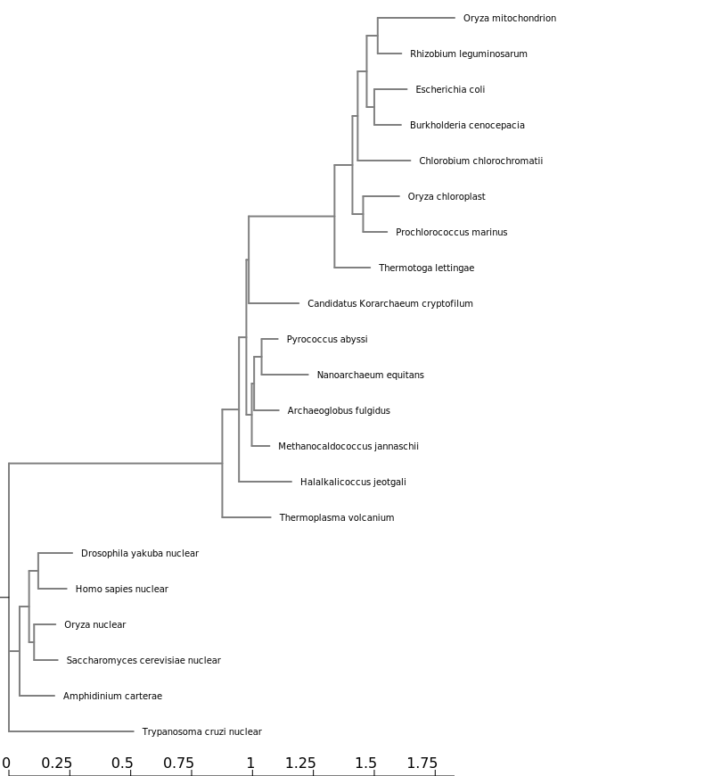

```{r setup, include=FALSE}
knitr::opts_chunk$set(echo = TRUE)
```

1. 

Multiple sequence alignments were performed using MAFFT and curated with BMGE. Tree inference was generated by FastME, with all steps being done remotely on NGPhylogeny.fr.

## ggtree Tutorial Steps
```{r}
library(tidyverse)
library(ggtree)
library(treeio)
library(ggimage)
```

```{r}
tree <- read.tree("data/tree_newick.nwk")
tree
```

```{r}
ggplot(tree) + geom_tree() + theme_tree()
ggtree(tree)
```
```{r}
ggtree(tree) + geom_treescale()
ggtree(tree) + theme_tree2()
```
```{r}
ggtree(tree, branch.length="none")
```
```{r}
ggtree(tree, branch.length="none", color="blue", size=2, linetype=3)
```

Exercise 1
1.
```{r}
ggtree(tree, layout = "slanted")
```
2.
```{r}
ggtree(tree, layout = "circular")
```
3.
```{r}
ggtree(tree, layout = "circular", branch.length = "none", color = "red", size = 3)
```

```{r}
p <- ggtree(tree)

p + geom_nodepoint()

p + geom_tippoint()

p + geom_tiplab()
```

## Exercise 2
```{r}
p <- ggtree(tree) +
 geom_nodepoint(color = "yellow", size = 4, alpha = 0.5) +
 geom_tippoint(color = "purple", pch = 18, size = 2) +
 geom_tiplab(color = "purple") +
  ggtitle("Exercise 2 Figure: I wish I were Color Blind")
p
```

```{r}
ggtree(tree) + geom_text(aes(label=node), hjust=-.3)
```
```{r}
ggtree(tree) + geom_tiplab()
```

```{r}
MRCA(tree, c("C", "E"))
```
```{r}
MRCA(tree, c("G", "H"))
```

```{r}
ggtree(tree) + 
  geom_cladelabel(node=17, label="a clade",  color="red2", offset=.8)+ 
  geom_cladelabel(node=21, label="b clade", 
                  color="blue", offset=.8)
```
```{r}
ggtree(tree) + 
  geom_tiplab() + 
  geom_cladelabel(node=17, label="a clade", 
                  color="red2", offset=.8, align=TRUE) + 
  geom_cladelabel(node=21, label="b clade", 
                  color="blue", offset=.8, align=TRUE) + 
  theme_tree2() + 
  xlim(0, 70) + 
  theme_tree()
```
```{r}
ggtree(tree) + 
  geom_tiplab() + 
  geom_hilight(node=17, fill="gold") + 
  geom_hilight(node=21, fill="purple")
```
```{r}
ggtree(tree) + 
  geom_tiplab() + 
  geom_taxalink("E", "H", color="blue", size = 2) +
  geom_taxalink("C", "G", color="orange", curvature=-.5, size = 1.5)
```

## Exercise 3

```{r}
MRCA(tree, c("B", "C"))
```
```{r}
MRCA(tree, c("L", "J"))
```
```{r}
ggtree(tree) +
  geom_tiplab()+
  geom_highlight(19, fill = "purple")+
  geom_highlight(23, fill = "orange") +
  geom_cladelabel(node = 17, label = "a superclade", color = "blue", align = TRUE) +
  geom_taxalink("C", "E", linetype = 2) +
  geom_taxalink("G", "J", linetype = 2) +
  theme_tree2() +
  ggtitle("Exercise 3 Figure: R+L=J") +
  xlim(0, 70)
```


```{r}
tree <- read.beast("data/flu_tree_beast.tree")

ggtree(tree, mrsd="2013-01-01") + 
  theme_tree2() 

ggtree(tree, mrsd="2013-01-01") + 
  theme_tree2() + 
  geom_tiplab(align=TRUE, linesize=.5) + 
  xlim(1990, 2020) 
```

```{r}

```

```{r}
set.seed(42)
trees <- lapply(rep(c(10, 25, 50, 100), 3), rtree)
class(trees) <- "multiPhylo"
ggtree(trees) + facet_wrap(~.id, scale="free", ncol=4) + ggtitle("And another and another and another")
```

```{r}
tree <- rtree(30)

p <- ggtree(tree)

d1 <- data.frame(id=tree$tip.label, val=rnorm(30, sd=3))

p2 <- facet_plot(p, panel="dot", data=d1, geom=geom_point, aes(x=val), color='red3')

d2 <- data.frame(id=tree$tip.label, value = abs(rnorm(30, mean=100, sd=50)))

p3 <- facet_plot(p2, panel='bar', data=d2, geom=geom_segment, 
           aes(x=0, xend=value, y=y, yend=y), size=3, color='blue4') 

p3 + theme_tree2()
```
```{r}
newick <- "((Pongo_abelii,(Gorilla_gorilla_gorilla,(Pan_paniscus,Pan_troglodytes)Pan,Homo_sapiens)Homininae)Hominidae,Nomascus_leucogenys)Hominoidea;"

tree <- read.tree(text=newick)

d <- ggimage::phylopic_uid(tree$tip.label)
d$body_mass = c(52, 114, 47, 45, 58, 6)

p <- ggtree(tree) %<+% d + 
  geom_tiplab(aes(image=uid, colour=body_mass), geom="phylopic", offset=2.5) +
  geom_tiplab(aes(label=label), offset = .2) + xlim(NA, 7) +
  scale_color_viridis_c()
p
```


```{r}
library(treeio)
```

```{r}
CIPRES_tree <- read.tree("lab8_fastree_result.tre")
```
```{r}
MRCA(CIPRES_tree, "Drosophila_yakuba_nuclear", "Trypanosoma_cruzi_nuclear")
```
```{r}
MRCA(CIPRES_tree, "Nanoarchaeum_equitans", "Candidatus_Korarchaeum_cryptofilum_")
```
```{r}
MRCA(CIPRES_tree, "Prochlorococcus_marinus", "Oryza_mitochondrion")
```

```{r}
ggtree(CIPRES_tree) +
  geom_tiplab(size = 3, align = TRUE) +
  theme_tree()+
  xlim(0,2) +
  geom_highlight(node = 22, fill = "gold") +
  geom_highlight(node = 25, fill = "blue") +
  geom_highlight(node = 30, fill = "red", extend = 0.55)
```

